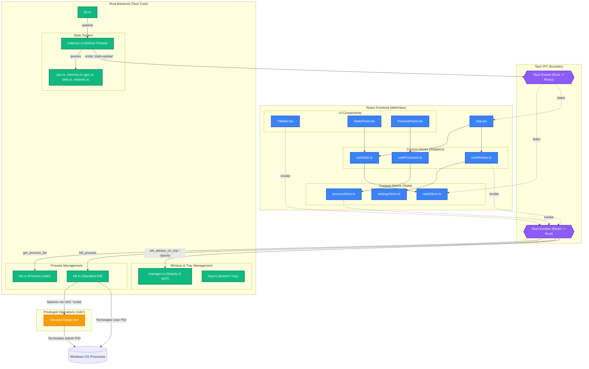

# PC Stats Monitor

A compact, always-on-top desktop overlay for real-time hardware monitoring and process management. Built with **Tauri 2**, **Rust**, and **React 19**.

## ⚡ Features

- **Real-time Monitoring**: Live tracking of CPU, RAM, GPU, Temperatures, Network, and Disk activity.
- **Process Manager**: View running processes with the ability to terminate standard or elevated processes (via UAC prompt).
- **Always-on-Top**: A toggleable overlay that stays visible while you work or game.
- **System Tray Integration**: Minimize to tray, toggle visibility, and quick-access controls.
- **Performance Focused**: Minimal footprint (< 1% CPU idle target) using optimized Rust background polling.
- **Custom UI**: Frameless, modern interface with high-refresh-rate sparklines and customizable opacity.

## 🏗️ Architecture & Component Relationships

The application is built on a **two-process model** using **Tauri 2**, where a high-performance **Rust Backend (Core)** manages OS-level operations, and a modern **React 19 Frontend (WebView)** renders the user interface.

### Component Relationship Diagram

The diagram below maps the relationships and data flows between the React frontend components, state stores, custom hooks, Tauri's IPC boundaries, the Rust backend services, and the elevated execution helper.



### Key Communication & Data Flow

#### 1. Live Stats Stream (Unidirectional Data Push)
To maintain a target `< 1%` idle CPU usage, metrics collection avoids polling from the frontend:
- **Rust Backend**: [collector.rs](file:///c:/Users/USER/Desktop/PCStatsMonitor/src-tauri/src/stats/collector.rs) spawns a dedicated OS thread on startup. Every 500ms, it queries sub-modules ([cpu.rs](file:///c:/Users/USER/Desktop/PCStatsMonitor/src-tauri/src/stats/cpu.rs), [memory.rs](file:///c:/Users/USER/Desktop/PCStatsMonitor/src-tauri/src/stats/memory.rs), [gpu.rs](file:///c:/Users/USER/Desktop/PCStatsMonitor/src-tauri/src/stats/gpu.rs), [disk.rs](file:///c:/Users/USER/Desktop/PCStatsMonitor/src-tauri/src/stats/disk.rs), and [network.rs](file:///c:/Users/USER/Desktop/PCStatsMonitor/src-tauri/src/stats/network.rs)) and emits a `stats-update` event containing a consolidated `SystemStats` payload.
- **Frontend listener**: [statsStore.ts](file:///c:/Users/USER/Desktop/PCStatsMonitor/src/store/statsStore.ts) registers a listener for `stats-update` using Tauri's `listen` API. When a new payload arrives, it updates the current state and appends values to the `cpuHistory` and `ramHistory` rolling charts (buffered to 60 data points / 30 seconds).
- **React Hook**: [useStats.ts](file:///c:/Users/USER/Desktop/PCStatsMonitor/src/hooks/useStats.ts) wraps the subscription logic, managing listener creation on mount and cleaning up the listener on unmount to prevent memory leaks.

#### 2. Process Management & Privilege Escalation (UAC Flow)
The process list and termination system leverages a multi-tiered privilege design:
- **Process Listing**: [useProcesses.ts](file:///c:/Users/USER/Desktop/PCStatsMonitor/src/hooks/useProcesses.ts) requests the process list via [processStore.ts](file:///c:/Users/USER/Desktop/PCStatsMonitor/src/store/processStore.ts), which invokes the Tauri command `get_process_list`. This maps directly to the backend's [list.rs](file:///c:/Users/USER/Desktop/PCStatsMonitor/src-tauri/src/process/list.rs) utilizing the Rust `sysinfo` library.
- **Standard Kill**: Standard processes owned by the current user are killed directly via the `kill_process` Tauri command inside [kill.rs](file:///c:/Users/USER/Desktop/PCStatsMonitor/src-tauri/src/process/kill.rs).
- **Elevated Kill (UAC Flow)**: If standard termination returns an access-denied error, the backend flags that administrative rights are required. The frontend displays the [KillConfirmModal.tsx](file:///c:/Users/USER/Desktop/PCStatsMonitor/src/components/ProcessPanel/KillConfirmModal.tsx) prompting the user to elevate.
  - Upon confirmation, the frontend invokes `kill_process_elevated`.
  - The backend ([kill.rs](file:///c:/Users/USER/Desktop/PCStatsMonitor/src-tauri/src/process/kill.rs)) spawns the [elevated-helper.exe](file:///c:/Users/USER/Desktop/PCStatsMonitor/elevated-helper/src/main.rs) executable using a PowerShell execution script: `Start-Process -Verb RunAs -WindowStyle Hidden`.
  - This invokes the Windows User Account Control (UAC) prompt. If approved by the user, the helper binary executes with full admin privileges, kills the process via its PID, and exits.
- **Protected (SYSTEM) processes**: Critical system components (e.g., `lsass.exe`, `csrss.exe`) are blocked from termination entirely.

#### 3. Window & Settings Management
User settings and overlay controls operate using persistent channels:
- **Zustand Store**: [settingsStore.ts](file:///c:/Users/USER/Desktop/PCStatsMonitor/src/store/settingsStore.ts) retains active settings (theme, window opacity, always-on-top toggle, autostart toggle).
- **Window Synchronization**: The [useWindow.ts](file:///c:/Users/USER/Desktop/PCStatsMonitor/src/hooks/useWindow.ts) hook listens to change events and invokes backend handlers ([manager.rs](file:///c:/Users/USER/Desktop/PCStatsMonitor/src-tauri/src/window/manager.rs)) to toggle `always_on_top` status, write to the system registry for `autostart`, and adjust window opacity.
- **Opacity Application**: Opacity adjustments are propagated as a `set-opacity` event from backend to the frontend [App.tsx](file:///c:/Users/USER/Desktop/PCStatsMonitor/src/App.tsx), applying custom CSS variables dynamically to the WebView layout (`--app-opacity`).

## 🚀 Getting Started

### Prerequisites
- Rust (stable)
- Node.js (LTS)
- Windows Build Tools (for `sysinfo` and `webview2`)

### Installation

1. Clone the repository:
   ```bash
   git clone <repository-url>
   cd PCStatsMonitor
   ```

2. Install dependencies:
   ```bash
   npm install
   ```

3. Run in development mode:
   ```bash
   npm run tauri dev
   ```

### Building

To create a production-ready installer:
```bash
npm run tauri build
```

To build the elevated helper specifically:
```bash
cd elevated-helper && cargo build --release
```

## 🛠️ Project Structure

- [src/](file:///c:/Users/USER/Desktop/PCStatsMonitor/src): React frontend (Typescript).
  - [components/](file:///c:/Users/USER/Desktop/PCStatsMonitor/src/components): UI components (TitleBar, Stats panels, etc).
  - [store/](file:///c:/Users/USER/Desktop/PCStatsMonitor/src/store): Zustand state management.
  - [hooks/](file:///c:/Users/USER/Desktop/PCStatsMonitor/src/hooks): Custom hooks for IPC and event subscription.
- [src-tauri/](file:///c:/Users/USER/Desktop/PCStatsMonitor/src-tauri): Rust backend (Tauri application).
  - [src/stats/](file:///c:/Users/USER/Desktop/PCStatsMonitor/src-tauri/src/stats): Logic for hardware data collection.
  - [src/process/](file:///c:/Users/USER/Desktop/PCStatsMonitor/src-tauri/src/process): Process listing and killing logic.
  - [src/window/](file:///c:/Users/USER/Desktop/PCStatsMonitor/src-tauri/src/window): Tray and window management (AOT, Opacity).
- [elevated-helper/](file:///c:/Users/USER/Desktop/PCStatsMonitor/elevated-helper): Separate Rust CLI tool for UAC-elevated process termination.

## 📝 Implementation Notes

- **CPU Accuracy**: The monitor requires two refresh cycles before CPU usage readings are accurate (delta-based).
- **GPU Support**: Supports NVIDIA (NVML) with WMI fallbacks for AMD/Integrated graphics.
- **Fullscreen Games**: Note that "Always on Top" may not work over certain exclusive-mode fullscreen games due to Windows OS limitations.

---
*Built with ❤️ using Tauri.*