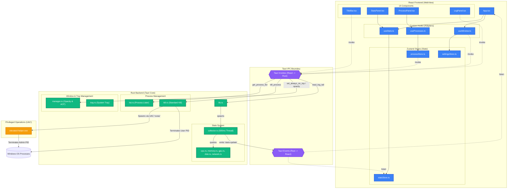

<p align="center">
  
</p>

<h1 align="center">STATS AGENT</h1>

<p align="center">
  
  
  
  
</p>

> A compact, always-on-top desktop overlay for real-time hardware monitoring and process management.

PC Stats Monitor sits in the corner of your screen and streams live CPU, RAM, GPU, temperature, network, and disk data straight from a background Rust thread — no browser, no heavy Electron runtime, just a frameless WebView with a small memory footprint. It doubles as a lightweight process manager, letting you find and kill runaway processes (elevating via UAC when needed) without opening Task Manager.

## Features

- **Real-time monitoring** — live CPU, RAM, GPU, temperature, network, and disk activity, pushed from Rust to the UI every 500ms.
- **Process manager** — search running processes, see their icons, and terminate standard or elevated processes via a UAC prompt.
- **In-app log viewer** — tail, filter, and search the app's own structured log file without leaving the window.
- **Always-on-top overlay** — frameless, draggable, resizable window that stays visible while you work or game.
- **System tray integration** — minimize to tray, toggle visibility, and toggle always-on-top from the tray menu.
- **Configurable UI** — adjustable opacity, dark/light theme, and toggles for which stat sections are shown.
- **Performance focused** — targets < 1% idle CPU usage via a single dedicated polling thread on the Rust side.

> [!NOTE]
> GPU stats prefer NVIDIA NVML for the richest data (temperature, power draw, accurate VRAM) and fall back to WMI on Windows for AMD, integrated, or idle-Optimus NVIDIA GPUs. If no GPU is detected at all, the GPU section is hidden automatically.

## Architecture

The application is built on a **two-process model** using **Tauri 2**, where a high-performance **Rust backend (core)** manages OS-level operations and a **React 19 frontend (WebView)** renders the UI. A separate privileged helper executable handles process termination that requires administrator rights.

### Component relationships

The diagram below maps the relationships and data flows between the React frontend components, state stores, custom hooks, Tauri's IPC boundaries, the Rust backend services, and the elevated execution helper.


```mermaid
graph TD
    %% Define Styling
    classDef frontend fill:#3b82f6,stroke:#1d4ed8,stroke-width:2px,color:#fff;
    classDef backend fill:#10b981,stroke:#047857,stroke-width:2px,color:#fff;
    classDef helper fill:#f59e0b,stroke:#d97706,stroke-width:2px,color:#fff;
    classDef ipc fill:#8b5cf6,stroke:#6d28d9,stroke-width:2px,color:#fff;

    %% React Frontend Group
    subgraph Frontend ["React Frontend (WebView)"]
        App["App.tsx"]

        subgraph Hooks ["Custom Hooks (Adapters)"]
            useStats["useStats.ts"]
            useProcesses["useProcesses.ts"]
            useWindow["useWindow.ts"]
        end

        subgraph Stores ["Zustand Stores (State)"]
            statsStore["statsStore.ts"]
            processStore["processStore.ts"]
            settingsStore["settingsStore.ts"]
        end

        subgraph UI ["UI Components"]
            TitleBar["TitleBar.tsx"]
            StatsPanel["StatsPanel.tsx"]
            ProcessPanel["ProcessPanel.tsx"]
            LogPanel["LogPanel.tsx"]
        end
    end

    %% Tauri IPC Boundary Group
    subgraph IPC ["Tauri IPC Boundary"]
        Events{{"Tauri Events (Rust -> React)"}}
        Invokes{{"Tauri Invokes (React -> Rust)"}}
    end

    %% Rust Backend Group
    subgraph Backend ["Rust Backend (Tauri Core)"]
        lib["lib.rs"]

        subgraph StatsService ["Stats System"]
            collector["collector.rs (500ms Thread)"]
            collectors["cpu.rs, memory.rs, gpu.rs, disk.rs, network.rs"]
        end

        subgraph ProcessService ["Process Management"]
            plist["list.rs (Process Lister)"]
            pkill["kill.rs (Standard Kill)"]
        end

        subgraph WindowService ["Window & Tray Management"]
            wmanager["manager.rs (Opacity & AOT)"]
            wtray["tray.rs (System Tray)"]
        end
    end

    %% Elevated Helper Group
    subgraph Helper ["Privileged Operations (UAC)"]
        ehelper["elevated-helper.exe"]
    end

    %% Relationships / Data Flow
    %% UI to Hooks
    App --> useStats
    App --> useWindow
    StatsPanel --> useStats
    ProcessPanel --> useProcesses

    %% Hooks to Stores
    useStats --> statsStore
    useProcesses --> processStore
    useWindow --> settingsStore

    %% Frontend to IPC Invokes
    processStore -.->|invoke| Invokes
    useWindow -.->|invoke| Invokes
    TitleBar -.->|invoke| Invokes
    LogPanel -.->|invoke| Invokes

    %% IPC Events to Frontend
    Events -.->|listen| statsStore
    Events -.->|listen| App

    %% Rust Backend Setup & Polling
    lib -->|spawns| collector
    collector -->|queries| collectors
    collector -->|emits 'stats-update'| Events

    %% IPC Invokes to Backend Commands
    Invokes -->|get_process_list| plist
    Invokes -->|kill_process| pkill
    Invokes -->|set_always_on_top / opacity| wmanager
    Invokes -->|read_log_tail| lib

    %% Privilege Escalation Flow
    pkill -->|Spawns via UAC 'runas'| ehelper
    ehelper -->|Terminates Admin PID| OS[("Windows OS Processes")]
    pkill -->|Terminates User PID| OS

    %% Apply Classes
    class App,TitleBar,StatsPanel,ProcessPanel,LogPanel,useStats,useProcesses,useWindow,statsStore,processStore,settingsStore frontend;
    class lib,collector,collectors,plist,pkill,wmanager,wtray backend;
    class Events,Invokes ipc;
    class ehelper helper;
```

### Key data flows

**Live stats stream (unidirectional push).** To maintain a target < 1% idle CPU usage, metrics collection avoids polling from the frontend entirely:

- `src-tauri/src/stats/collector.rs` spawns a dedicated OS thread on startup. Every 500ms it queries the `cpu`, `memory`, `gpu`, `disk`, and `network` sub-collectors and emits a `stats-update` event with a consolidated `SystemStats` payload.
- `src/store/statsStore.ts` listens for `stats-update` via Tauri's `listen` API, updating current values and appending to rolling `cpuHistory` / `ramHistory` charts (buffered to 60 points / 30 seconds).
- `src/hooks/useStats.ts` wraps the subscription, managing listener setup on mount and teardown on unmount.

**Process management & privilege escalation (UAC flow).**

- `src/hooks/useProcesses.ts` requests the process list through `processStore.ts`, which invokes `get_process_list` — handled by `src-tauri/src/process/list.rs` via the `sysinfo` crate.
- Standard processes are killed directly through the `kill_process` command (`src-tauri/src/process/kill.rs`).
- If that returns access-denied, the UI shows `KillConfirmModal.tsx` prompting elevation. On confirmation, `kill_process_elevated` spawns `elevated-helper.exe` via `Start-Process -Verb RunAs -WindowStyle Hidden`, triggering the Windows UAC prompt. Once approved, the helper terminates the PID with admin rights and exits.
- Protected SYSTEM processes (`lsass.exe`, `csrss.exe`, etc.) are blocked from termination entirely.

**Window & settings management.**

- `src/store/settingsStore.ts` persists theme, opacity, always-on-top, and autostart preferences to `localStorage`.
- `src/hooks/useWindow.ts` syncs those settings to the backend (`src-tauri/src/window/manager.rs`), which toggles `always_on_top`, writes the autostart registry key, and applies opacity via a `set-opacity` event consumed as a CSS variable (`--app-opacity`) in `App.tsx`.

## Getting Started

### Prerequisites

- [Rust](https://www.rust-lang.org/tools/install) (stable toolchain)
- [Node.js](https://nodejs.org/) (LTS)
- Windows build tools (required by the `sysinfo` and `webview2` crates)

### Installation

```bash
git clone https://github.com/yuri044/PCStatsDisplay.git
cd PCStatsDisplay
npm install
```

### Run in development mode

```bash
npm run tauri dev
```

### Build for production

```bash
npm run tauri build
```

This produces a signed installer under `src-tauri/target/release/bundle/`.

> [!TIP]
> The elevated-helper executable used for admin-level process termination builds automatically as part of `npm run tauri build`. To build it on its own (e.g. while iterating on UAC logic), run:
>
> ```bash
> cd elevated-helper && cargo build --release
> ```

## Project Structure

```
├── src/                    React frontend (TypeScript)
│   ├── components/         UI components (TitleBar, StatsPanel, ProcessPanel, LogPanel, ...)
│   ├── store/               Zustand state management
│   └── hooks/               Custom hooks for IPC calls and event subscriptions
├── src-tauri/               Rust backend (Tauri application)
│   ├── src/stats/           Hardware data collection (CPU, RAM, GPU, disk, network)
│   ├── src/process/         Process listing, icon extraction, and kill logic
│   └── src/window/          Tray and window management (always-on-top, opacity)
└── elevated-helper/          Standalone Rust CLI for UAC-elevated process termination
```

## Implementation Notes

- **CPU accuracy** — the monitor needs two refresh cycles before CPU usage readings stabilize, since the underlying calculation is delta-based.
- **Logging** — structured logs are written to `%APPDATA%\com.pcmonitor.app\logs\app.log`, rotated at 5 MB (3 files kept). Set `RUST_LOG=trace` for a one-off deep-debugging session; the in-app Logs tab and the titlebar's folder icon both give quick access to them.

> [!WARNING]
> "Always on Top" may not stay above certain exclusive-mode fullscreen games, due to how Windows handles that mode at the OS level.

---

_Built with Tauri._
